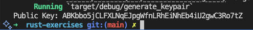
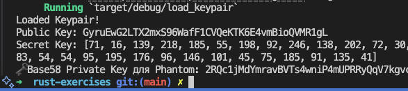
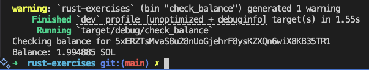

# Практика 1.6

1. Генерація пари ключів

Результат виконання скрипта `generate_keypair.rs`:

2. Завантаження пари ключів з файлу

Результат виконання скрипта `load_keypair.rs`:

3. Перевірка балансу гаманця

Скрипт `check_balance.rs` з логікою перевірки балансу гаманця. 
Для наочності використано гаманець із ненульовим балансом:

